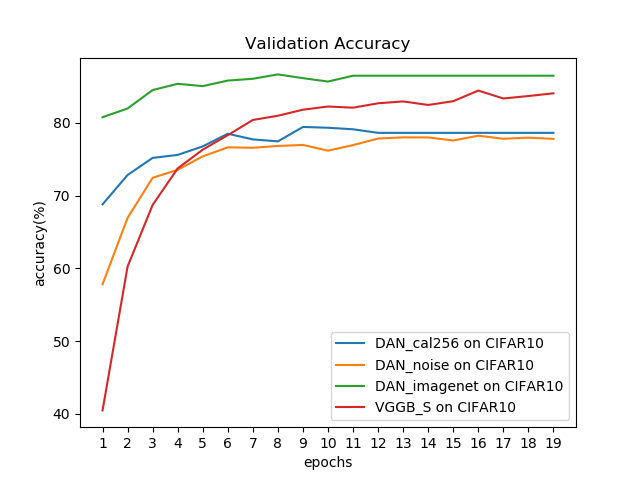

# ReproDANs
You need to download MNIST, CIFAR10 and Caltech256 for these files.
The good news is pytorch datasets have integrated the first two; the bad news is the last one isn't.

They are the reproducibility test for the being-reviewed paper "Incrimental Learning Through Deep Adaptation Neural Network",
as a project for COMP 652 Machine Learning.

[This is another fancy reproduction, check it out!](https://github.com/jianingsun21/cnn_incremental-learning)\
[Code written by the author of "Incrimental Learning Through DAN" can be found here](https://github.com/rosenfeldamir/incremental_learning)

As of currently, we have evaluated three models.

Test accuracy:

| Test Acc     | CIFAR10 |
|--------------|---------|
| VGGB S       | 82.22   |
| DAN noise    | 77.48   |
| DAN imagenet | 86.52   |
| DAN cal256   | 79.21   |
Some trivial details in our experiments:
* When initializing the weights in controller modules, we use Identity matrix which is better than initializing randomly; the authors used "Kaiming-uniform" distribution which is interesting
* Adam optimizer is considerably faster in terms of convergence speed, compared to SGD optimizer
* Softmax operation is inherent in pytorch's cross-entropy loss function
* GTX 1060 is awesome
* We don't pad images to the same size, which in default to vgg models is 224 by 224; CIFAR10 images are 32 by 32, maybe padding them all to 224 by 224 is not a good idea
* We simply modify the classifiers, making the first dense layer flatten(512,1,1), where 512 is the size of out channel at the last convolution layer

